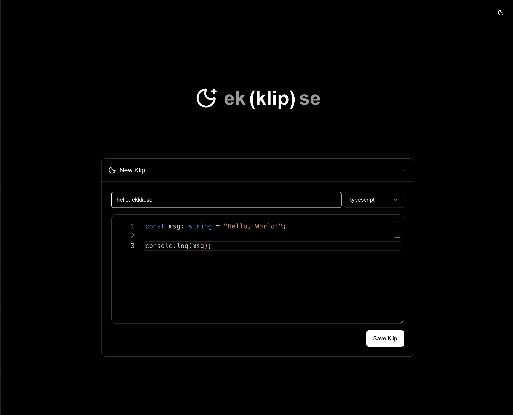

# ekklipse

ekklipse is a simple pastebin app to share links, code, or other text with your friends, colleagues, or yourself on another device.



## Contributing

This is a [Next.js](https://nextjs.org) project bootstrapped with [`create-ekko-app`](https://github.com/mikekenway/create-ekko-app).

There isn't a ton I want to add to this feature wise at the moment, but i would love help containerizing this for easier deployment in a homelab! Otherwise, it's on my list to learn...

1. Fork this repo
2. Clone your fork: `git clone https://github.com/YOUR_USERNAME/ekklipse.git`
3. Make your changes
4. Submit a pull request

First, run the development server:

```bash
pnpm dev
```

Dev Server: [http://localhost:3000](http://localhost:3000)

- [Next.js Documentation](https://nextjs.org/docs) - learn about Next.js features and API.
- [Convex Documentation](https://docs.convex.dev) - learn about Convex real-time database and backend.
- [Tailwind CSS Documentation](https://tailwindcss.com/docs) - learn about utility-first CSS framework.
- [shadcn/ui Documentation](https://ui.shadcn.com) - learn about the re-usable components library.
- [Monaco Editor Documentation](https://microsoft.github.io/monaco-editor/) - learn about the code editor that powers VS Code.
